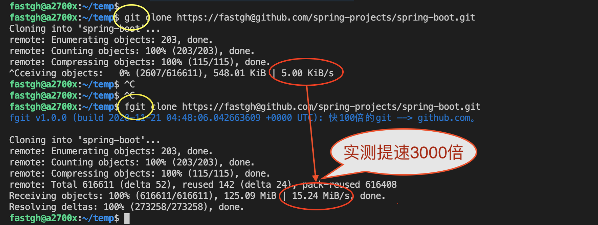

# fgit


fgit是一个可以无缝替换git命令行的工具，使用优化线路为使用github.com加速。

# 特点：
  - 目前实测git clone速度超过15MB/S；后续为保护线路资源，计划限速为1MB/S
  - 支持push到github.com私有库
  - 两种工作模式：镜像（反向代理）模式和HTTP代理模式，都是实时连接github.com，不是缓存
  - 支持包括clone/push/pull/fetch在内的各种git命令，兼容git命令行参数，可以用来无缝替换git命令行
  - 只针对github.com加速，不干扰对非github.com库的使用
  - 使用go语言开发，不是shell脚本或.bat，跨平台（Windows、Linux、Mac)

# 工作原理：
  git clone为什么慢成每秒几个KB？DNS污染和‘墙’等流传的原因都已经过时了，现在的原因只有一个：因为走的是糟糕的国际线路。所以，解决起来其实也很简单直接，fgit使用的镜像服务器和HTTP代理服务器接入的是优化线路。

  知乎上这篇文章做了比较好的解释：[git clone一个github上的仓库，太慢，经常连接失败，但是github官网流畅访问，为什么？](https://www.zhihu.com/question/27159393)

  但是，毕竟那样设置起来比较麻烦，容易出错，而且，如果走的是github.com.cnpmjs.org等镜像，只能clone，不能push。fgit把这些包装了起来，是这么做的：
  - 自动判断是使用镜像模式还是使用代理模式，默认情况下，只对git push命令和私有库启用代理模式。
  - 调用git命令前，如果判断是clone/push/pull/fetch，并且是github.com，那么设置镜像或者代理。
  - 调用git命令行（所以需要自己已经安装了git命令行）
  - 调用git命令后，取消镜像或者代理设置

  镜像服务器或者代理服务器的列表是动态更新，我们会不断更新这个列表。为防止滥用和被误`墙`，代理服务器做了域名访问的限制，只允许访问github.com。

# 几种方案的对比：
|               | fgit | 公共镜像(https://github.com.cnpmjs.org等）| 自建代理或VPN | 导入国内GIT(码云等) | 缓存(https://gitclone.com) | 代下载(http://gitd.cc) |
| :------------ | :--- | :-------------------------------------: | :----------: | :---------------: | :----------------------: | :-------------------: |
| 浏览器访问     |      | [x]                                     | [x]          | [x]               |                           |                      |
| git命令行     | [x]  | [x]                                     | [x]          | [x]               | [x]                       |                      |
| 无需手工设置   | [x]  |                                         |              |                   |                           | [x]                  |
| 支持push      | [x]  |                                         | [x]          |                   |                           |                      |
| 支持私有库     | [x]  |                                         | [x]          |                   |                           |                      |
| 免费          | [x]  | [x]                                     |              | [x]               | [x]                       | [x]                  |
| 实时(非缓存)   | [x]  | [x]                                     | [x]          |                   |                           |                      |
| 不容易被误`墙` | [x]  | [x]                                     |              | [x]              |                           |                      |
| 动态更新服务器 | [x]   |                                        |              |                   |                           |                      |


## 安装:
  下载页面：[https://github.com/fastgh/fgit/releases](https://github.com/fastgh/fgit/releases)

  - Windows: [https://github.com/fastgh/fgit/releases/download/v1.0.0/fgit.exe](https://github.com/fastgh/fgit/releases/download/v1.0.0/fgit.exe)，下载后把它加入系统路径环境变量

  - Linux / Mac:

  ```shell
     sudo curl -L https://github.com/fastgh/fgit/releases/download/v1.0.0/fgit.$(echo `uname -s` | tr A-Z a-z) -o /usr/local/bin/fgit
     sudo chmod +x /usr/local/bin/fgit
  ```

## 使用：
   和常规的git命令行几乎相同，支持各种命令行参数，譬如：

   - 对于公共库，clone/pull/fetch时默认使用镜像模式，基于安全考虑，镜像模式不支持私有库

   `fgit clone https://github.com/spring-projects/spring-boot.git --depth=1`

   - 两种情况会判定为私有库，对于私有库是使用HTTP代理模式，比镜像模式安全

      1. push

      2. URL中包含用户名，那么会被判定为私有库，clone/pull/fetch时默认使用镜像模式。
         对于clone命令，URL是从clone的URL中解析得到，对于其它git命令，则使用`git remote -v`得到

     例如：

      1. `fgit push origin master`

      2. `fgit clone https://fastgh@github.com/fastgh/fgit.git`

     也可以通过`--use-proxy`选项强制走HTTP代理模式

     例如:

      1. `fgit --use-proxy clone https://github.com/fastgh/fgit.git`

   - 其它：

     1. 可以打开调试开关，看一看fgit的工作过程：下载服务器列表 --> 设置镜像或代理 --> 执行git --> 回复镜像或代理

      `fgit --debug clone https://github.com/fastgh/fgit.git`

     2. fgit首次运行时，会在用户主目录下生成一个配置文件.fgit.json，包含服务器地址等信息，必要时可以通过设置这个文件选择接入其它服务方，或指定镜像服务器或代理服务器

## 编译：

  - 安装GO语言开发环境，要求GO版本>=13

  - Linux / Mac环境下，`$ ./build.sh`，编译成功后可执行文件会生成`build`目录下；Windows环境下类似，参考`build.sh`

## 问题反馈和交流：

   请提交GITHUB Issues，或者：
   
   
